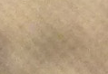

# Antigone Notes by Katarina Kelsey

## booklet 1

Holderlin did not want to fuck Antigone

## booklet 2

I’ll show you in red

  It was, I think, necessary to alter the sacred wording here 
 

Hence, as already touched upon in the notes on Oedipus, the dia-  
logic form and the chorus as its antithesis, hence also the dangerous  
form in the scenes, which, in a way more characteristic of the Greeks,  
has a necessarily factive outcome in this sense that the word becomes  
more mediatedly factive and seizes rather the body's senses; but in  
our times and according to our conception of things, it becomes  
more immediate and seizes rather the body's spirit. The language  
of tragedy for the Greeks is lethally factive, because the body it  
seizes hold of does literally kill. For us, standing as we do under a  
You dye your words with red You seem to colour a red word You seem to dy-  
e a red word They seem to dye a red work They seem to colour a red word  
They seem to colour a red word.  

  whereas our chief striving in the  
way our times see things is to hit upon something, to have a fate,  
because having no fate, being _dysmoron_, is our weakness  

  It was, I
think, necessary to alter the sacred wording here but most of all  
tragedy consists in factive words that, more a context than an  
utterance, move in the manner of Fate from the beginning to the end;  
What is it? ~~They seem to colour a red word you seem to colour a Red Word?~~  

The tragically moderate weariness of the times, whose object is  
of no real interest to the heart, follows the pull of the spirit of the  
times without the least moderation and this spirit appears then as  
something wild and not, like a ghost in daylight, sparing man at  
all, but quite pitiless, as the spirit of the always alive unwritten  
wilderness and the world of the dead. right Rightly right. The real  
language of Sophocles, whereas Aeschylus and Euripides are better  
able to objectify suffering and anger but less the mind of a man going  
on its way under the unthinkable.	but most of all  
tragedy consists in factive words that, more a context than an  
utterance, move in the manner of Fate from the beginning to end;  
It was, I think, necessary to alter the sacred wording here  

right Rightly right

## booklet 3

German | English |
---  | ---  |
So weit ist sie entfernt, von zwei   erstorbenen Sprachen die taube   Gleichung zu sein, daß gerade   unter allen Formen ihr als   Eigenstes es zufällt, auf jene   Nachreife des fremden Wortes,  auf die Wehen des eigenen zu   merken. | So if you translate Wehen by   “birth pangs,” you would have to   translate it by “death pangs” as   much as by “birth pangs,” and   the stress is perhaps mre on   death than on life. |   

A  
Together sister a lot! o Ismene head!  
You know something that is not earth father  
Learned that we live here  
A Nennbares , gehascht since Oedipus was ?  
No traur'ge work, no Irrsal ,  
And is shameful and dishonorable nowhere a  
I do not see you, my misfortune .  
But now, you ahnest what the commander  
Made in offner city that we only know ?  
Did you hear that ? or you do not know  
How to love evil enemies ?  
I  
Not a word came to me, Antigone , of loving ,  
Not a very nice and not a sad since  
The two brothers , both of us have lost ;  
The 1 day running died two hands ;  
But away when the army of Argos ,  
Vergangne night, I do not know  
And I 'm not happy and not worried.  
A  
I also thought , and called thee in judgment  
Because you see could hear more.  
I  
What is it that you seem to color a red word ?  
A  
Has the recent honor not because our brothers  
Creon gekränzt beschimpfet alternately ?  
Although Eteocles , they say, he treated  
With the right right right after and ports  
Him in the earth, the dead worshipful down there.  
From the other but the poor died ,  
Of Polynices ' body do they say that you  
He preached in the city, it  
Without heavy mountain and not betraure .  
You should let him unlamented and grablos ,  
Sweet meal the birds see licentiousness pleasure.  
Something in the way , as they say, you have the good Creon  
And I, for myself, I mean, for expression ,  
And here he comes , the ignorant  
Clear Report . And the thing is  
Not, as for everything. Who makes these  
Is death by stoning in places.  
So it is you. And soon you will prove  
Whether gutgeboren whether evil is good ?  

A  
Together sister Handsome ! o Ismene head!  
You know something that is not earth father  
Learned us that we live up hither ,  
A Nennbares , gehascht since Oedipus was ?  
Not a traur'ge work , no Irrsal ,  
And is shameful and dishonorable nowhere one  
I do not seen in yours, my misfortune .  
But now, you ahnest what the commander  
Made known to us in offner city , just ?  
Did you hear ? or do not you know ,  
How to Love cometh evil enemies ?  
I  
Not a word came to me, Antigone , of loving,  
No lovely and not a sad since  
The two brothers we both lost;  
Who died one day from two hands ;  
But since gone is the army of Argos ,  
Vergangne night , I know nothing more  
And I'm not happy and not troubled .  
A  
I thought well, and called thee from the farm gate  
Because thou 's could particularly hear .  
I  
What is it that you seem to color a red word ?  
A  
Has the recent honor not because our brothers  
Creon gekränzt , beschimpfet , alternately ?  
Although Eteocles , they say, he treated  
With the right legal , law pursuant to , and harbors  
Him in the earth , the dead worshipful down there .  
From the other but who died poor ,  
Of Polynices ' body do they say that you 've  
It proclaimed in the city , that it  
With no grave mountain and not betraure .  
You should let him unlamented and grablos ,  
Sweet meal the birds see on self-indulgence pleasure.  
Something like that , they say, has the good Creon you  
And me, for me , I mean , manifested ,  
And here he comes, this ignorant  
Clearly Report . And the thing is  
Not, as for anything. Whoever does this ,  
Is the death of stoning in places .  
So it is you. And soon you 'll prove  
Whether gutgeboren whether the evil you the good?  

A  
Together Sister Some! o Ismene head!  
You know something that is not earth father  
Learned that we live up here  
A Nennbares , gehascht since Oedipus was ?  
No traur'ge work, no Irrsal ,  
And is shameful and dishonorable nowhere a  
I do not see in thee, my misfortune.  
But now, you ahnest what the commander  
Made in offner city that we know only ?  
Did you hear that ? or you do not know  
How to love evil enemies?  
I  
Not a word came to me, Antigone , of loving ,  
Not a very nice and not a sad since  
The two brothers , we have both lost ;  
The one day died two hands ;   
But away as is the army of Argos ,  
Vergangne night , I do not know anymore  
And I 'm not happy and not worried.  
A  
I also thought , and called thee from the court  
Because you 's could be heard more .  
I  
What is it that you seem to color a red word ?  
A  
Has the recent honor not because our brothers  
Creon gekränzt beschimpfet , alternately ?  
Although Eteocles , they say, he treated  
With the right right right after and ports  
Him in the earth, the dead worshipful down there.  
From the other but the poor died ,  
Of Polynices ' body do they say that you have  
He preached in the city, it  
Without heavy mountain and not betraure .  
You should let him unlamented and grablos ,  
Sweet meal the birds see licentiousness pleasure.  
Something in the way , as they say, the good Creon has you  
And I, for myself, I mean, for expression ,  
And here he comes , those ignorant  
Clear Report . And the thing is  
Not, as for everything. Who does this  
Is death by stoning in places.  
So it is you. And soon you will prove  
Whether gutgeboren whether evil the good?  

A  
Commonjointsisterlely ! o Ismene head!  
Do you even know that not the Earth Father  
Earntthrough permanently with us who live here ,  
Each name Ables , like Oedipus getsnatched ?  
No drear -rigged work or no scattering ,  
And is shameful and dishonorable a nowhere  
I am in you, not seen my Unlucks .  
But now you can guess that what Mr. field  
About Us doneandtold , in open city right now?  
Have you heard of it? or you do not know  
How to Loved comes Enemiesevil ?  
I  
Not a word came to me, Antigone , love,  
Non- irritating and / or drearrigged As did  
The two brothers , both of which we lost ;  
She died the day of the two hands ;  
But since gone into the herd of Argos ,  
Last night, knowing nothing  
And I'm not happy, and I 'm not sad .  
A  
I thought so too , and called to the farm gate  
Aboutit that yous could particularly HearIt .  
I  
What is't a red word color appear ?  
A  
Has the recent honor then not our brothers  
Scolded crowned Creon , wiselyinturn ?  
Eteocles but behandled that one to him  
Right Right , Lawaccordingly and stored  
Dead to honor him in the earth, down there.  
From the other side , that poor dead,  
Of Polynices ' body , they say, has  
He preached in the city, it  
Without Grabhügelund no sorrow .  
A goal unlamented and leave tombless him ,  
Sweet food for birds on Foodmuck welcome .  
So something that one has the good Creon you  
And I, because I also , I think , made known ,  
And here it comes, these unknowns  
Clearly Report . And the thing is  
Not, as for everything. Who does what  
You'd death by stoning in places.  
So it is you. And now you're wanting to prove  
If wellborn when evil good?  

A  
Commonjointsisterlely ! o Ismene head!  
Do you even know that not the Earth Father  
Earntthrough constantly with us who live here ,  
Each name Ables , like Oedipus getsnatched ?  
No drear -rigged work or no scattering ,  
And is shameful and dishonorable nothing  
I am in you, not seen my Unlucks .  
But now that you can imagine what Mr. Field  
About Us doneandtold , in open city right now?  
Have you heard of it? or you do not know  
So Loved comes Enemiesevil ?  
I  
Not a word came to me, Antigone , love,  
Non-irritating and / or drearrigged How have  
The two brothers , both of which we lost ;  
She died on the day of the two hands ;  
But since gone into the herd of Argos,  
Last night, knowing nothing  
And I'm not happy, and I 'm not sad .  
A  
I thought so too , and called on the farm-gate  
Aboutit that yous could particularly HearIt .  
I  
What is't a red word in a different color ?  
A   
Has the recent honor then not our brothers  
Scolded crowned Creon , wiselyinturn ?  
Eteocles but behandled that one to him  
Right Right , Lawaccordingly and stored  
Dead to honor him in the ground down there.  
From the other side , that poor dead,  
Of Polynices ' body , they say, has  
He preached in the city, it  
Without Grabhügelund no sorrow .  
A goal unlamented and let him tombless ,  
Sweet food for birds on Foodmuck welcome.  
So something that one has the good Creon you  
And I, because I also , I think , made known ,  
And here it comes, these unknowns  
Clear Report . And the thing is  
Not, as for everything. Who does what  
You should death by stoning in places.  
So it is you. And now you want to prove are  
If wellborn when evil good ?   

A  
Commonjointsisterlely ! o Ismene head!  
Do you even know that not the Earth Father  
Earntthrough with us who live here permanently ,  
Each name Ables , as Oedipus getsnatched ?  
Not a drear -rigged work or no stray,  
And is shameful and dishonorable nowhere a ,  
That I am in you , not seen my Unlucks .  
But now , you guessed that what Mr. Field the  
About Us doneandtold , in open city , right now ?  
Have you heard of it? or you do not know  
How on Loved comes Enemiesevil ?  
I  
Not a word came to me, Antigone , love ,  
Non-irritating and / or not drearrigged , since did  
The two brothers , both we lost ;  
They died one day from two hands ;  
But since gone to the herd of Argos ,  
Last night, knowing nothing more  
And I'm not happy, and I 'm not sad .  
A  
I thought so too , and called to the yard gate  
Aboutit that yous could particularly HearIt .
I  
What is't you seem a red word color ?  
A  
Has the recent honor then not our brothers  
Creon crowned scolded , wiselyinturn ?  
Eteocles but behandled that one to him  
Right Right, Lawaccordingly and stored  
Him in the earth , the Dead honor down there.  
From the other hand , that poor dead ,  
Of Polynices ' body , they say , has  
It proclaimed in the city , that it  
Without Grabhügelund no sorrow .  
One aims unlamented and tombless left him ,  
Sweet food for birds seen on Foodmuck pleasure.  
So something that one has the good Creon you  
And I, cause I also , I think, made known ,  
And here it comes, these unknowns  
Clearly report . And the thing is  
Not, as for anything. Who does something  
You would Death of stoning in places .  
So it is you. And now you want to prove  
If wellborn when evil the good?  

A  
Commonjointsisterlely! o Ismenes Head!  
Know you any, that not the Earth Father  
Earntthrough, with us, the we to hereto live,  
Any Nameables, since Oedipus getsnatched?  
Not one drear-rigged Work, or no Erring,  
And shameful ist and honourless nowhere one,  
That I in yours, my Unlucks not seen.  
Now though, guessed you that, what the FieldHerr  
Us doneandtold, in open City, just now?  
Have you heard it? or know you not,  
How on the Loved comes Enemiesevil?  
I  
Not came one Word to me, Antigone, of Love,  
Not lovely and/or not drearrigged, sincethat  
The both Brothers both we lost;  
They died one Day from two Hands;  
Since but gone that Herd from Argos is,  
Last Night, knowing nothing further more  
And I’m not happy and I’m not sad.  
A  
That thought I well and cried you out the Yardgate  
Aboutit, that yous especially hearit could.  
I  
What is’t, du scheinst ein rotes Wort zu farben?  
A  
Has with the last Honour then not our Brothers  
Kreon garlanded, scolded, wiselyinturn?  
Eteokles though, that one behandled he  
With rightly Right, Lawaccordingly, and saved  
Him in the Earth, honourable the Dead down there.  
From other though, that dead is poor,  
From Polyneikes’ Body say they, one has  
It in the city preached, that one him  
With no Grave mound and no mourning.  
One targets him left unlamented and tombless,  
Sweet Meal for Birds, who on Foodmuck Lust see.  
So something, said one, has the good Kreon you  
And me, cause me’s also my I, madeknown,  
And here comes it, these Unknowns  
Clearly to report. And the Thing is  
Not, like for nothing. Who etwas does this,  
Them would that Death of Stoning in Places.  
So stands it to you. And now would you to prove  
If wellborn, if the evil you the good  

## booklet 4

due scheinst ein rotes Wort zu färben

English |
--- |
There is no document of   civilization which is not at the   same time a document of   barbarism.  |

It was, I think, necessary to alter the sacred wording here  
form in the scenes, which, in a way more characteristic of the Greeks,  
has a necessarily factive outcome in this sense that the word becomes  
more mediatedly factive and seizes rather the body's senses; but in  
utterance, move in the manner of Fate from the beginning to the end;  
What is it? ~~They seem to colour a red word you seem to colour a Red Word]right Rightly right~~ The real  
language of Sophocles, whereas Aeschylus and Euripides are better  
able to objectify suffering and anger but less the mind of a man going  
on its way under the unthinkable. For us, standing as we do under a  
You dye your words with red You seem to colour a red word You seem to dy-  
e a red word They seem to dye a red word They seem to colour a red word  
They seem to color a red word but most of all tragedy consists in factive  
words that, more a context than an utterance, move in the manner of  
Fate from the beginning to the end;having no fate, being _dysmoron_, is our  
weakness.

## information sheet

Antigone Notes: Red;  
performs a presentation of possession - its power play has spurting and gathering  
out fabric as fabric The performer edits this power play fill up the pierced by the with.  
is materialization

1. 
2. Holderlin reordered
3. Walter Benjamin | Paul de Man; Holderlin reordered
4. Holderlin Reordered; Walter Benjamin | ; Holderlin reordered

Part of AM Bruno Red project 2015.  
Katarina Kelsey http://katarinakelseybookarts.tumblr.com/